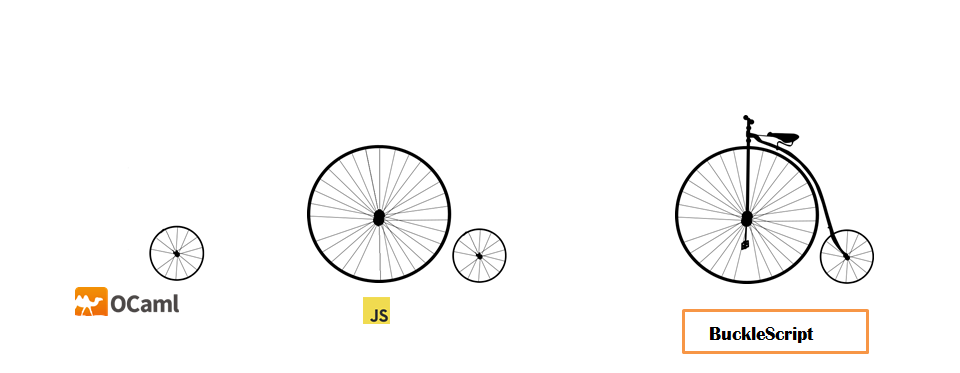
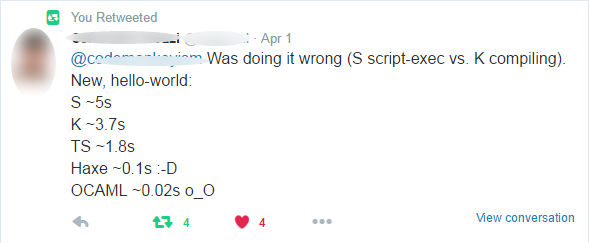
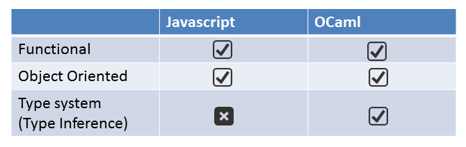

class: center, middle

#  OCaml <3 Javascript 



Hongbo Zhang@Bloomberg

July 27, 2016

---

# What's BuckleScript

- Readable JavaScript backend for OCaml
- *module to module* compiler
- *Seamless integration* with existing JS libs
- Works with multiple front-end: vanilla OCaml and [Facebook Reason](https://facebook.github.io/reason/)
---

# Why do we care about JS platform

- JS is the only language of the browser

- JS is everywhere (Electron for Desktop App, NodeJS on server
  side, huge potential on IoT)

- JS is where people are (npm: [largest package manager 2 years ago](http://www.modulecounts.com/))

---


# Major Benefits of BuckleScript

- It's OCaml, not a new language (30 years distilled research in PL and continous effort of compiler engineering)
  - Native backends: AMD64, IA32, PowerPC, ARM, SPARC
  - Language based Unikernel: Mirage
  - Battle tested: Used for high-frequency trading in volumes of billions of
    dollars per day.
- BuckleScript backend :
  - Higher (both compile-time and runtime) performance
  - *Expressive* and *efficient* FFI
  - Smaller size (a fairly small runtime *linked only when needed*)
  - Seamless integration with existing JS ecosystem (module to module
    compilation, support for various module systems: Google module/ AMDJS and CommonJS)
  
  
---

# R & B (Facebook Reason and Bloomberg BuckleScript)

- Reason is a new interface to OCaml created by the same people who created ReactJS
- It provides a Javascript like syntax and toolchain for editing, building, and sharing code
- Facebook uses OCaml a lot in its infrastructure: Flow JS type checker, Infer static analyzer, and Hack compiler, etc
- [It works with Bloomberg's BuckleScript nicely](http://bloomberg.github.io/bucklescript/reason-demo/)

---


# What BuckleScript looks like

```ocaml
let test () =
  let m = ref IntMap.empty in
  let count = 1000000 in
  for i = 0 to count do
    m := IntMap.add i i !m
  done;
  for j = 0 to count  do
    ignore (IntMap.find j !m )
  done;;
test()
```

```js

"use strict";
var Int_map=require("./int_map.js");

function test() {
  var m = /* Empty */0;
  for(var i = 0; i <= 1000000; ++i){
    m = add(i, i, m);
  }
  for(var j = 0; j <= 1000000; ++j){
    find(j, m);
  }
  return /* () */0;
}

test(/* () */0);
```

---

# Comparison with hand-written JS

```js
// Immutable map from Facebook immutable library

'use strict';
var Immutable = require('immutable');
var Map = Immutable.Map;
var m = new Map();
function test(){
    var count  = 1000000
    for(var i = 0; i < count; ++i){
        m = m.set(i, i );
    }
    for(var j = 0; j < count ; ++j){
        m.get(j)
    } }
test ()
```

Runtime performance of identical functionality:

| Technology   |  Time(ms) | Code Size  |
|--------------|----------| -----------|
| OCaml with Javascript Backend   |1186ms (Google Closure bundler: simple mode) |   1 KB | 
| Handwritten Facebook Javascript  |3415ms |  55.3 KBytes|

---

# Finishes before others warm up

- A truly fast compiler

  
- A micro benchmark vs TypeScript 
   - one file defines 500 fib functions
   - one file calls those 500 fib functions
   ```
             BS: 0m0.063s
             TS: 0m1.427s
   ```
- Even worse for whole program compilation transpilers 

---

# Beyond performance:

>  Expressive and efficient FFI is the major design goal
  
---

# FFI part one (Call OCaml from Javascript for free)

- OCaml signatures are respected (no extra work to do)
- Basic data types are closely matched (Array -> Array, Tuple -> Array, etc)
- BuckleScript can also emit `.d.ts` files for TypeScript compiler (*experimental*)

- [Publish and consume npm packages out of box](https://www.npmjs.com/package/bs-platform)
- [demo](https://tonicdev.com/npm/bs-platform)

```ocaml
var $$Array = require("bs-platform/lib/js/array")
var $$String = require("bs-platform/lib/js/string")
$$String.concat(",",$$Array.to_list(["hello","bucklescript"]))
```

---
# FFI part two : (Calling Javascript from OCaml)

Like typescript, users must write *type declarations* for existing
JavaScript Libraries.

- *extensible* language by extension points and attributes.
  - No re-inventing a new language needed
-  *expressive* type system to model different  paradigms in Javascript
  - Structual typing (model JavaScript Objects)
  - Polymorphic variants (model Event handler)
  - Label and optional arguments (model JSON configuration)

```
external val_name : types_to_js_object_or_function 
```
- *external* function type declarations
- *external* object signature

---
A dummy example:

```ocaml
external exp : float -> float = "Math.exp" [@@bs.call]
let v = exp 3.
```
---

# FFI highlights: native uncurried calling convention support

```ocaml
let f = fun [@bs] x y -> x + y
val f : int -> int -> int [@bs]
f 1 2 [@bs]
f 1  (* compile error *)
f 1 2 3 (* compile error *)

```
==> 

```js
function f(x,y){
  return x + y;
}
f (1,2)
```
---

# FFI hightlights: built-in *this* callback support

```ocaml
let f = fun [@bs.this] o x y -> body
val f : 'o -> 'x -> 'y -> 'body [@bs.this]
```

```ocaml
external array_map_this :
  'a array -> ('obj -> 'a -> int -> 'b [@bs.this]) -> 'obj -> 'b array
  = "map"  [@@bs.send]

array_map_this xs (fun [@bs.this] o v i -> (o,v,i)) xs 
```

==>

```js
xs.map(function(v,i){
  var o = this;
  return [o,v,i]
},xs)
```


---

# Optimized curry calling convention

```ocaml
let f x y z = x + y + z
let a = f 1 2 3 
let b = f 1 2 
```
==Naive-compilation=>
```js
function f(x){
  return function (y){
    return function (z){
      return x + y + z
    }
  }
}
var a = f (1) (2) (3)
var b = f (1) (2)
```
==Optimized-compilation=>
```js
function f(x,y,z) {return x + y + z}
var a = f(1,2,3)
var b = function(z){return f(1,2,z)}
```


---

# String and int literal type : [Polymorphic variant](http://andrewray.github.io/iocamljs/min402.html)


```ocaml
external readFileSync :
  string -> ([`utf8 | `ascii] [@bs.string]) ->
  string = "readFileSync"
  [@@bs.call]
  [@@bs.module "fs"]
let content = readFileSync "file.txt" `utf8
```
==>
```js
var Fs = require("fs");
var content = Fs.readFileSync("file.txt", "utf8")
```

---

# Event handlers using bucklescript

Typescript binding:
```ts
interface readline {
  on : (event:string, callback: Function)
}
```

```ocaml
type readline
external on : readline -> 
  ([ `line of string -> unit  (* can be customized [@bs.as "another_name"]*)
   | `close of unit -> unit ] 
     [@bs.string]) ->  unit = "on" [@@bs.send] 

let register readline = 
  on readline (`line begin fun s -> prerr_endline s end);
  on readline (`close begin fun () -> prerr_endline "finished" end)
```
==>
```js
function register(readline) {
  readline.on("line", function (s) {
        console.log(s);
        return /* () */0;
      });
  return readline.on("close", function () {
              console.log("finished");
              return /* () */0;
            });
}
```


---

# External JavaScript objects declaration

- [row polymorphism](http://andrewray.github.io/iocamljs/min402.html)
- class type, subtyping, and inhertiance
- In BuckleScript, `##` is used as method dispatch

```ocaml
let f obj = obj##height + obj##width
val f : [%bs.obj: < height : int ; width : int ; .. > ] -> int
let a = f [%bs.obj { height = 3; width = 32}] (* compiles *)
let b = f [%bs.obj {height = 3 ; width  = 32; unused = 3 }] (* compiles *)
```
==>
```js
function f (obj){
  return obj.height + obj.width;
}
var a = f ({height : 3, width : 32})
var b = f ({height : 3 , width : 32 , unused : 3})
```

---
# Another way to define object type

```ocaml
class type _heigth = object
  method height : int
end [@bs]
class type _width = object
  method width : int 
end [@bs]
class type _rect = object
   inherit _height
   inherit _width 
end [@bs]
type rect = _rect Js.t
```
subtyping rules

```ocaml
_rect :> _height
_rect Js.t :> _height Js.t 
```

---
# A stand alone HTTP server: part one  

```OCaml
(** [Http_lib.ml] *)
let port = 3000
let hostname = "127.0.0.1"
let create_server  http = 
  let server = http##createServer begin fun [@bs]  req  resp  -> 
      resp##statusCode #= 200; 
      resp##setHeader "Content-Type" "text/plain";
      resp##_end "Hello world\n" (* end is a key word in OCaml *)
    end
  in
  server##listen port hostname  begin fun [@bs] () -> 
      Js.log ("Server running at http://"^ hostname ^ ":" ^ Pervasives.string_of_int port ^ "/")
  end

```

```js
var hostname = "127.0.0.1";

function create_server(http) {
  var server = http.createServer(function (_, resp) {
        resp.statusCode = 200;
        resp.setHeader("Content-Type", "text/plain");
        return resp.end("Hello world\n");
      });
  return server.listen(3000, hostname, function () {
              console.log("Server running at http://" + (hostname + (":" + (Pervasives.string_of_int(3000) + "/"))));
              return /* () */0;
            });
}
```
---

# A stand alone HTTP server: part two 

```ocaml
type req 

class type _resp = object 
  method statusCode : int [@@bs.set]
  method setHeader : string -> string -> unit 
  method _end : string -> unit 
end [@bs]
type resp = _resp Js.t 

class type _server = object 
  method listen : int -> string -> (unit -> unit [@bs]) -> unit 
end [@bs]
type server = _server Js.t 

class type _http  = object 
  method createServer : (req  ->  resp  -> unit [@bs] ) ->  server
end [@bs]
type http = _http Js.t

external http : http = "http" [@@bs.val_of_module]
```


---

# A stand alone HTTP server: part three

```OCaml
(** [Http_start.ml]*)

let () =
  Http_lib.create_server Http_binding.http
```

```js
var Http_lib = require('./http_lib');
var http = require('http');
Http_lib.create_server(http);
```

---

# How can it be possible? (What's the magic?) 

1. OCaml is like a *formal* Javascript

   Both OCaml and Javascript have similar concepts which make compiling OCaml to Javascript posible:

    

2. OCaml has a similar **module system** to Javascript 2015, it supports both Javascript like structural typing
   and ML style type inference.
3. ML is used in some of the foundational work of JavaScript:
   - ES4 (abandoned standard) reference implementation
   - The first prototype of Facebook's ReactJS implementation
   - Official reference implementation of WebAssembly


---

# Internals of BuckleScript - an optimizing JS backend for OCaml

Leverage the (high-level, strongly typed) OCaml language tool-chain to generate optimized JS


- Dev mode:
  - *No name mangling*, easy to debug
  - Separate and **blazing fast** compilation
  - Simple integration with existing JS libraries
  - Dead code elimination and Purity analysis
  - Local and cross module optimization
- Production mode:
  - Link time optimization (combination with Google Closure Compiler)
  - Remove unused functions further in the library level
- Result:
  - **Faster, Smaller, and Safer!**


---

# The OCaml compiler workflow

```
 Source code
        |
        | parsing and preprocessing
        |
        v
    Parsetree (untyped AST)
        |
        | type inference and checking
        v
    Typedtree (type-annotated AST)
        |
        | pattern-matching compilation
        | elimination of modules and classes
        v
     Lambda ------------------------(our work)----------+
      /   \                                              \  
     /     \ closure conversion, inlining, uncurrying,    \
    v       \  data representation strategy                \ 
 Bytecode    \                                              |
    |         +-----+                                       |
    |              Cmm                                      IR
    |ocamlrun       |                                       |
    |               | code generation                       | code generation 
    |               | assembly & linking                    |
    v               v                                       v
 Interpreted    Compiled                                 Javacript(and meta data for optimizations)
```

---

# Comparison with  PureScript and GHCJS

* Similarities with PureScript: generates readable code, support for both strutural types and
  object oriented FFI

* Similarities with GHCJS: not a new language

* Optimizing compilers: (still early days)
  - Code motion
  - Effect analysis
  - Cross module inlining
  - Constant folding/propagation
  - Strength reduction
  

---

# Future work

* Bindings to existing JS libraries (using typescript compiler API or
  Facebook Flow type checker  (also written in OCaml))

* Toolings and help get people started

* More Optimizations


---

Follow me for the latest developments on BuckleScript

twitter @bobzhang1988


